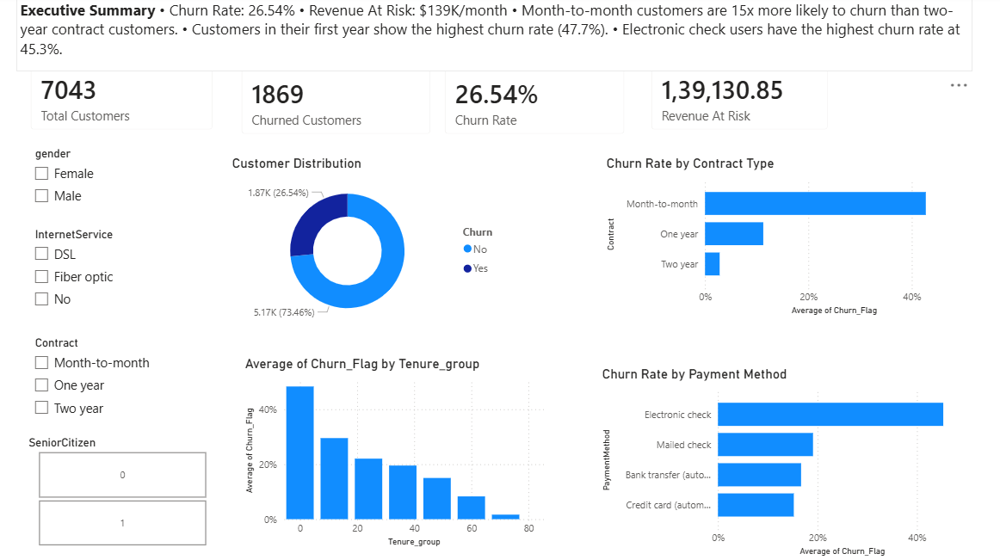
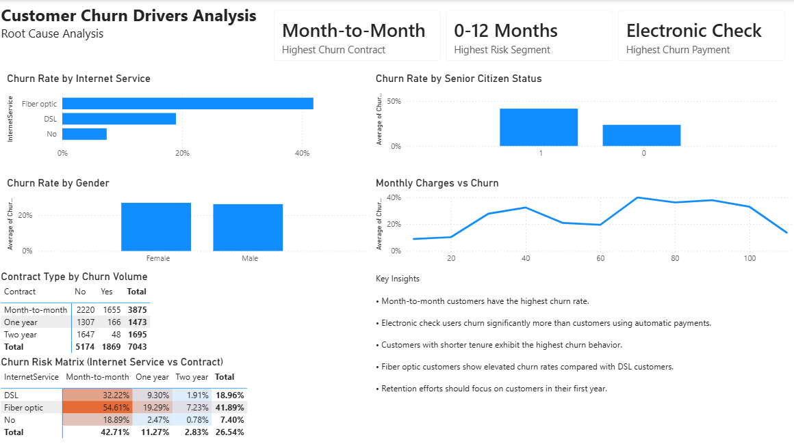
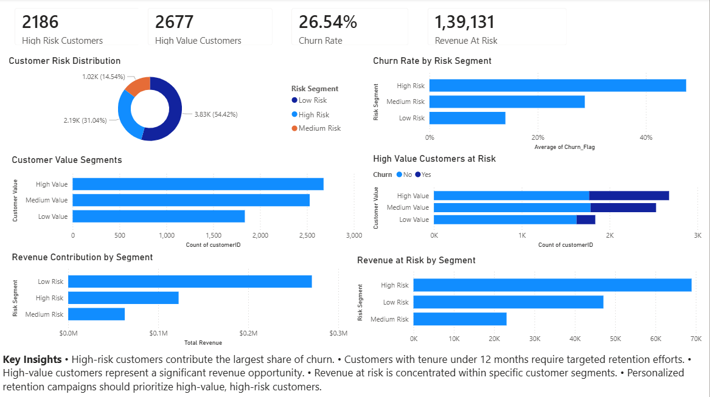
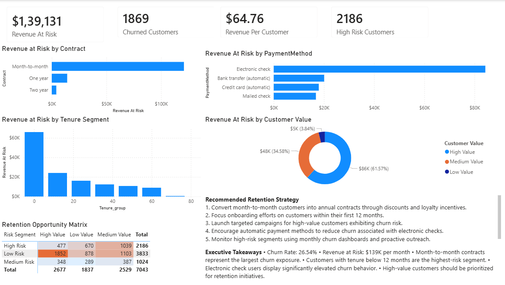

# Customer Churn Analytics Dashboard

## Project Overview

This project analyzes customer churn behavior for a subscription-based telecommunications company. The objective was to identify churn drivers, quantify revenue at risk, and provide actionable retention recommendations.

---

## Business Problem

Customer churn directly impacts revenue and profitability. Understanding which customer segments are most likely to leave allows businesses to implement targeted retention strategies and reduce revenue loss.

---

## Tools Used

- Python
- SQL
- Power BI
- Pandas
- NumPy
- Matplotlib
- Seaborn

---

## Project Workflow

1. Data Cleaning and Preparation
2. Exploratory Data Analysis
3. SQL-Based Business Analysis
4. Customer Segmentation
5. Power BI Dashboard Development
6. Business Recommendations

---

## Key Findings

### Churn Rate
26.54%

### Revenue At Risk
$139,130.85 per month

### Contract Analysis
- Month-to-month customers: 42.71% churn
- One-year customers: 11.27% churn
- Two-year customers: 2.83% churn

### Payment Method Analysis
- Electronic Check: 45.29% churn
- Credit Card (Automatic): 15.24% churn

### Tenure Analysis
- Customers in their first year: 47.68% churn
- Customers with 49–72 months tenure: 9.51% churn

---

## Dashboard Pages

### Executive Overview



### Churn Drivers



### Customer Segmentation



### Revenue at Risk & Retention Strategy



---

## Business Recommendations

1. Encourage long-term contracts through incentives.
2. Improve onboarding during the first 12 months.
3. Promote automatic payment methods.
4. Focus retention campaigns on high-value, high-risk customers.
5. Monitor churn KPIs through recurring executive dashboards.

---

## Repository Structure

```text
customer-churn-analytics-dashboard/
│
├── data/
├── notebooks/
├── sql/
├── powerbi/
├── screenshots/
└── README.md
```
